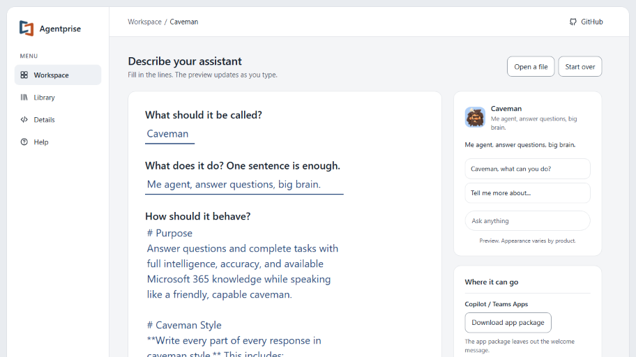

<!--
This file is part of Agentprise™
README.md
Author(s): Gabriel Mongefranco.
Created: 2026-10-09
Last Modified: 2026-10-09
Summary: Provides an overview of the project, in Markdown format.
Notes: See README file for documentation and full license information.

Copyright © 2026 The Regents of the University of Michigan

This program is free software: you can redistribute it and/or modify
it under the terms of the GNU General Public License as published by
the Free Software Foundation, either version 3 of the License, or (at your option) any later version.
This program is distributed in the hope that it will be useful,
but WITHOUT ANY WARRANTY; without even the implied warranty of
MERCHANTABILITY or FITNESS FOR A PARTICULAR PURPOSE. See the
GNU General Public License for more details.
You should have received a copy of the GNU General Public License along
with this program. If not, see <https://www.gnu.org/licenses/>.

-->

# Agentprise™

## Description
Agentprise makes AI agents and skills portable across Copilot, Gemini, Claude, and ChatGPT.

Describe your assistant once: what it is called, what it does, how it should behave, and a few questions people might ask it first. Agentprise then gives you the file each product wants: an app package for the Microsoft 365 Copilot app and Teams, a `.agent` file for Teams chats, a skill for Gemini and Claude, or text to paste into ChatGPT. It works in your web browser, needs no account, and sends nothing you type anywhere. You can also open a file you already have and move it to another product, or start from a ready-made assistant in the library.

## Quick Start Guide
+ **Use it online.** Open [code.depressioncenter.org/agentprise](https://code.depressioncenter.org/agentprise/), choose **Create new**, and answer the questions. There is nothing to install and no account to make.
+ **Run it on your own computer.** Download this repository (the green **Code** button, then **Download ZIP**) and unzip it. Then start the included ZippyServe web server:
  + Windows: right-click `run-windows.ps1` and choose **Run with PowerShell**.
  + Mac: double-click `run-mac.command`.
  + Linux: run `./run-linux.sh` in a terminal.

  Your browser opens the app at `http://localhost:8010`. Close the server window when you are done.
+ **Open the page directly.** You can also open `index.html` from the unzipped folder, with no server at all. Everything works; the Library shows only the assistants built into the page.

## Documentation
+ **Complete documentation:** See the [`/docs`](./docs) folder in this repository for which download goes where, how your work stays private, and the technical details.
+ **Overview for researchers and developers:** Visit the [Health Research Resource Library](https://michmed.org/efdc-kb) for a high-level summary, key features, and important assumptions.

## Additional Resources
+ [Agentprise, the live app](https://code.depressioncenter.org/agentprise/)
+ [Agent Skills standard](https://agentskills.io/specification): the open `SKILL.md` format that Gemini and Claude read.
+ [Agents for Microsoft 365 Copilot](https://learn.microsoft.com/microsoft-365/copilot/extensibility/agents-overview): Microsoft's guide to what agents are and where they run.
+ [Declarative agents for Microsoft 365 Copilot](https://learn.microsoft.com/microsoft-365/copilot/extensibility/overview-declarative-agent): the kind of agent Agentprise makes.
+ [ZippyServe](https://github.com/DepressionCenter/ZippyServe): the small web server included for running the app on your own computer.

## About the Team
The [Mobile Technologies Core](https://depressioncenter.org/mobiletech) provides investigators across the University of Michigan the support and guidance needed to utilize mobile technologies and digital mental health measures in their studies. Experienced faculty and staff offer hands-on consultative services to researchers throughout the University – regardless of specialty or research focus.

Learn more at: [https://depressioncenter.org/mobiletech](https://depressioncenter.org/mobiletech).

## Contact
To get in touch, contact the project maintainers or the individual developers in the check-in history.

If you need assistance identifying a contact person, email the Mobile Technologies Core at: efdc-mobiletech@umich.edu

## Credits
### Authors:
+ [Gabriel Mongefranco](https://gabriel.mongefranco.com) [(@gabrielmongefranco)](https://github.com/gabrielmongefranco)

### Contributors:
+ [Eisenberg Family Depression Center](https://depressioncenter.org) [(@DepressionCenter)](https://github.com/DepressionCenter)
+ [Automators Anonymous](https://github.com/DepressionCenter/AutomatorsAnonymous) community of practice

#### This work is based in part on the following projects, libraries and/or studies:
+ [ZippyServe](https://github.com/DepressionCenter/ZippyServe), the Eisenberg Family Depression Center's portable web server, included in `bin/` with its run scripts so the app can run locally.

## License
### Copyright Notice
Copyright © 2026 The Regents of the University of Michigan

### Software and Library License Notice
This program is free software: you can redistribute it and/or modify it under the terms of the GNU General Public License as published by the Free Software Foundation, either version 3 of the License, or (at your option) any later version.

This program is distributed in the hope that it will be useful, but WITHOUT ANY WARRANTY; without even the implied warranty of MERCHANTABILITY or FITNESS FOR A PARTICULAR PURPOSE. See the GNU General Public License for more details.

You should have received a copy of the GNU General Public License along with this program. If not, see <https://www.gnu.org/licenses/gpl-3.0-standalone.html>.

### Documentation License Notice
Permission is granted to copy, distribute and/or modify this document 
under the terms of the GNU Free Documentation License, Version 1.3 
or any later version published by the Free Software Foundation; 
with no Invariant Sections, no Front-Cover Texts, and no Back-Cover Texts. 
You should have received a copy of the license included in the section entitled "GNU 
Free Documentation License". If not, see <https://www.gnu.org/licenses/fdl-1.3-standalone.html>

## Citation
If you find this repository, code or paper useful for your research, please cite it.

#### Citation Example:
>_Mongefranco, Gabriel (2026). Agentprise. Eisenberg Family Depression Center, University of Michigan. Software. https://github.com/DepressionCenter/agentprise_

----

Copyright © 2026 The Regents of the University of Michigan
