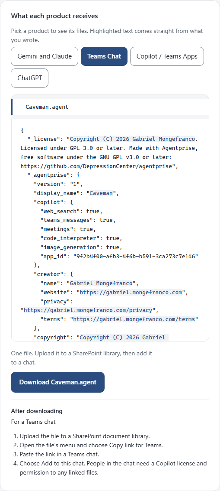

<!--
This file is part of Agentprise
docs/how-to/add-an-assistant-to-a-teams-chat.md
Author(s): Gabriel Mongefranco.
Created: 2026-10-09
Last Modified: 2026-10-09
Summary: Step-by-step guide with screenshots: download the .agent file and add
         an assistant to a Teams group chat, channel, or meeting chat.
Notes: See README file for documentation and full license information.

Copyright © 2026 The Regents of the University of Michigan

Licensed under the GNU Free Documentation License v1.3 or later.
See <https://www.gnu.org/licenses/fdl-1.3.html>. See README for full license information.

-->

# Agentprise

## Put an assistant in a Teams group chat

[Back to project README](../../README.md)

An app package works in the Agents list, but it does not answer in a group
chat, a channel, or a meeting chat. For those, Teams wants a `.agent` file
stored in a SharePoint library. This guide downloads that file and adds it to
a chat. It takes about five minutes once the assistant is written. You need a
Microsoft 365 account with Copilot and a SharePoint library the people in the
chat can reach.

### Step 1: Have your assistant open in Agentprise

Open [code.depressioncenter.org/agentprise](https://code.depressioncenter.org/agentprise/)
and either make a new assistant or open a file you have. If you need help
with that part, see
[Make a new assistant for Microsoft 365 Copilot](make-an-assistant-for-copilot.md)
or
[Open an assistant you have](move-an-assistant-to-gemini-or-claude.md).

Teams chats show a welcome message when someone opens the assistant, so this
is a good time to write one. Choose **More** under the questions and type it
in the **Welcome message** box.

### Step 2: Download the .agent file

Under **Where it can go**, find **Teams Chat** and choose **Download .agent
file**. Your browser saves one file named after the assistant, such as
`Caveman.agent`.

To see the file before you download it, choose **Details** on the left and
then the **Teams Chat** tab. Everything you wrote is in this one file,
including the welcome message and the picture.

### Step 3: Put the file in SharePoint

These steps happen in SharePoint and Teams, so Agentprise cannot show them.

1. Open a SharePoint document library that the people in your chat can reach.
   A library on the team's own site is the usual choice.
2. Upload the `.agent` file to it.
3. Open the file's menu and choose **Copy link for Teams**.

### Step 4: Add it to the chat

1. Open the group chat, channel, or meeting chat in Teams.
2. Paste the link you copied.
3. Choose **Add to this chat**.

The assistant now answers in that chat. People in the chat need a Copilot
license and permission to any SharePoint files you linked. Guests cannot use
it in Teams chats.

### Changing it later

Drop the `.agent` file on the Workspace start page in Agentprise, make your
changes, and download it again. Upload the new file to SharePoint in place of
the old one, and the chat picks up the change.

### Conclusion

Your assistant now answers in a Teams chat, and the one `.agent` file in
SharePoint is all it takes to keep it there. If you also want it in the
Agents list, download the app package as well. The
[formats page](../formats.md) explains the difference between the two files.

### Additional resources

- [Agentprise, the live app](https://code.depressioncenter.org/agentprise/)
- [Make a new assistant for Microsoft 365 Copilot](make-an-assistant-for-copilot.md)
- [Open an assistant you have and move it to Gemini or Claude](move-an-assistant-to-gemini-or-claude.md)
- [Formats: which download goes where](../formats.md)
- [Frequently asked questions](../faq.md)

[Back to project README](../../README.md)
