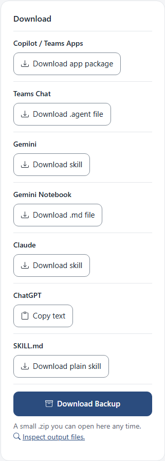

<!--
This file is part of Agentprise
docs/how-to/copy-an-assistant-into-chatgpt.md
Author(s): Gabriel Mongefranco.
Created: 2026-10-09
Last Modified: 2026-10-10
Summary: Step-by-step guide with screenshots: copy an assistant's text into a
         ChatGPT custom GPT or a Gemini Notebook.
Notes: See README file for documentation and full license information.

Copyright © 2026 The Regents of the University of Michigan

Licensed under the GNU Free Documentation License v1.3 or later.
See <https://www.gnu.org/licenses/fdl-1.3.html>. See README for full license information.

-->

# Agentprise

## Copy an assistant into ChatGPT or Gemini Notebook

[Back to project README](../../README.md)

ChatGPT and Gemini Notebook have no file you can upload, so Agentprise gives
you the text to copy and paste instead. This guide shows where the text is
and which field each piece goes in. It takes a few minutes once the assistant
is written.

What carries over is the name, the description, the instructions, and the
example questions. The picture, the welcome message, and the Copilot settings
do not, because these products have no place for them.

### Step 1: Have your assistant open in Agentprise

Open [code.depressioncenter.org/agentprise](https://code.depressioncenter.org/agentprise/)
and either make a new assistant or open a file you have. See
[Make a new assistant for Microsoft 365 Copilot](make-an-assistant-for-copilot.md)
or
[Open an assistant you have](move-an-assistant-to-gemini-or-claude.md)
if you need help with that part.

### Step 2: Choose Copy text

Under **Where it can go**, find **ChatGPT** and choose **Copy text**.

The Details page opens on the **ChatGPT** tab. It shows four boxes, one for
each field, with a copy button under each one.

If a copy button says copying is blocked, the app selects the text for you.
Press Ctrl+C on Windows or Command+C on a Mac to copy it.

### Step 3: Paste into ChatGPT

These steps happen in ChatGPT, so Agentprise cannot show them.

1. In ChatGPT, open **Explore GPTs**, then **Create**.
2. Open the **Configure** tab.
3. Paste each box into the matching field. The example questions go in
   **Conversation starters**, one per line.
4. Save the GPT.

### Step 4: Paste into Gemini Notebook

1. Open the notebook in Gemini.
2. Choose **More**, then **Notebook settings**.
3. Paste the **Instructions** box into the instructions field.

If you would rather add the whole assistant as a source, choose the
**Download** button under the boxes. You get a small `.md` file, such as
`Caveman.md`, with everything in one place. Add that file to the notebook as
a source.

### Conclusion

Your assistant now works in ChatGPT or Gemini Notebook with the same name,
description, instructions, and example questions. Keep your Agentprise copy
so you can change it in one place and copy the text again.

### Additional resources

- [Agentprise, the live app](https://code.depressioncenter.org/agentprise/)
- [Make a new assistant for Microsoft 365 Copilot](make-an-assistant-for-copilot.md)
- [Open an assistant you have and move it to Gemini or Claude](move-an-assistant-to-gemini-or-claude.md)
- [Formats: what each download keeps](../formats.md)
- [Frequently asked questions](../faq.md)

[Back to project README](../../README.md)
