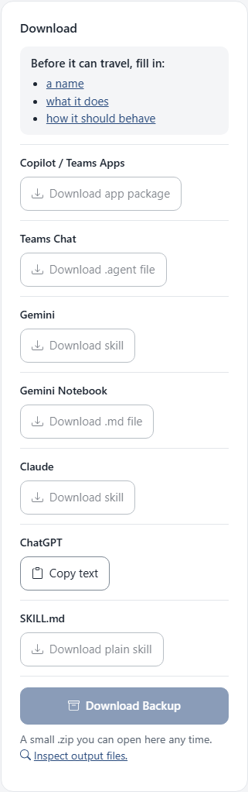
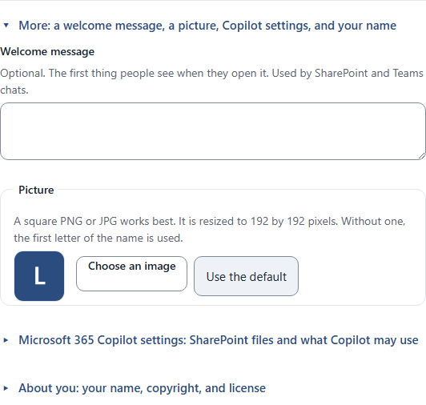

<!--
This file is part of Agentprise
docs/how-to/make-an-assistant-for-copilot.md
Author(s): Gabriel Mongefranco.
Created: 2026-10-09
Last Modified: 2026-10-09
Summary: Step-by-step guide with screenshots: make a new assistant in Agentprise
         and add it to the Agents list in Microsoft 365 Copilot or Teams.
Notes: See README file for documentation and full license information.

Copyright © 2026 The Regents of the University of Michigan

Licensed under the GNU Free Documentation License v1.3 or later.
See <https://www.gnu.org/licenses/fdl-1.3.html>. See README for full license information.

-->

# Agentprise

## Make a new assistant for Microsoft 365 Copilot

[Back to project README](../../README.md)

This guide takes you from a blank page to an assistant in the Agents list of
the Microsoft 365 Copilot app or Teams. It takes about ten minutes. You need a
web browser and a Microsoft 365 account that includes Copilot. Agentprise
itself needs no account, and nothing you type leaves your browser.

The example assistant is called Lab Helper. It answers questions about lab
procedures and safety. Use your own idea in its place.

### Step 1: Open Agentprise and choose Create new

1. Go to [code.depressioncenter.org/agentprise](https://code.depressioncenter.org/agentprise/).
   The Workspace start page opens.
2. Choose **Create new** on the right.

### Step 2: Answer the four questions

The editor shows four questions with a blank under each one. Gray example text
in a blank shows the kind of answer that goes there. It disappears when you
type.

1. Under **What should it be called?**, type a short name. This is how the
   assistant will be listed in Copilot. The example is Lab Helper.
2. Under **What does it do?**, write one sentence that says what it is for.
   The example is "Answers questions about lab procedures and safety."
3. Under **How should it behave?**, describe how you want it to answer, what
   it should focus on, and what it should avoid. Plain English works. If you
   are not sure where to start, choose **Help me write this** to get a short
   template you can fill in.
4. Under **What might people ask it first?**, type a few questions people
   might ask. They will be able to click these instead of typing. Choose
   **Add another question** to add more, up to twelve.

The preview on the right updates as you type, so you can see roughly what
people will get.

### Step 3: Check that it is ready to travel

Look at the **Where it can go** card under the preview. While the name, the
description, or the behavior is still empty, the card lists what is missing
and the download buttons stay gray. Each item in the list is a link that takes
you to that blank.

Once all three are filled in, the buttons turn on.

### Step 4: Add a picture and your name

These settings are optional, but they make the assistant look finished in
Copilot. Choose **More: a welcome message, a picture, Copilot settings, and
your name** under the questions to open them.

- **Picture.** Choose **Choose an image** and pick a square PNG or JPG. The
  app resizes it to the sizes Copilot wants. Without one, Copilot shows the
  first letter of the name on a blue square.
- **About you.** Open this section and fill in your name, your website, and
  links to a privacy page and a terms page. The Copilot app package needs all
  four. If you leave any blank, the app fills in placeholder values and tells
  you so before you download.
- **Microsoft 365 Copilot settings.** Open this section to paste links to
  SharePoint files the assistant should read. It also lets you choose what
  Copilot may use, such as web search or meeting notes. Leave these as they
  are if you are not sure.
- **Welcome message.** Teams chats and SharePoint show this when someone opens
  the assistant. The Copilot app package has no place for it, so you can skip
  it for this guide.

### Step 5: Download the app package

1. Under **Where it can go**, find **Copilot / Teams Apps** and choose
   **Download app package**.
2. Your browser saves a `.zip` file named after the assistant, such as
   `Lab Helper Copilot app.zip`. Leave it zipped. Copilot wants the whole
   package.

If you want to see what is inside first, choose **Details** on the left and
then the **Copilot / Teams Apps** tab. The files are listed on the right, and
the words you wrote are highlighted. The same **Download** button is there
too.

### Step 6: Upload it to Copilot

These steps happen in Microsoft's software, so Agentprise cannot show them.
The screens vary a little from one organization to another.

1. Open the Microsoft 365 Copilot app, or open Teams.
2. Choose **Agents**.
3. Choose **Upload**. In some versions you choose **Create** first, then
   **Upload**.
4. Pick the `.zip` file you downloaded.
5. Choose **Share** to give the assistant to other people.

If the upload is refused, your Microsoft 365 admin may need to allow custom
agents for your organization. People who use the assistant need a Copilot
license and permission to any SharePoint files you linked.

### Step 7: Keep a copy

Choose **Keep a copy I can edit later** at the bottom of the **Where it can
go** card. You get a small `.zip` file, such as `lab-helper.zip`. Keep it
somewhere safe.

To change the assistant later, drop that file on the Workspace start page,
make your changes, and download the app package again. Upload the new file in
place of the old one. It keeps the same id, so Copilot treats it as an update
rather than a second assistant.

### Conclusion

You now have an assistant in the Agents list, a package you can share, and a
copy you can edit. The same description can go to other products too. See
the guides for [Teams chats](add-an-assistant-to-a-teams-chat.md),
[Gemini and Claude](move-an-assistant-to-gemini-or-claude.md), and
[ChatGPT](copy-an-assistant-into-chatgpt.md).

### Additional resources

- [Agentprise, the live app](https://code.depressioncenter.org/agentprise/)
- [Put an assistant in a Teams group chat](add-an-assistant-to-a-teams-chat.md)
- [Open an assistant you have and move it to Gemini or Claude](move-an-assistant-to-gemini-or-claude.md)
- [Copy an assistant into ChatGPT or Gemini Notebook](copy-an-assistant-into-chatgpt.md)
- [Formats: which download goes where](../formats.md)
- [Frequently asked questions](../faq.md)
- [Agents for Microsoft 365 Copilot](https://learn.microsoft.com/microsoft-365/copilot/extensibility/agents-overview)

[Back to project README](../../README.md)
