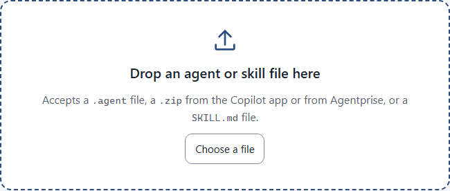
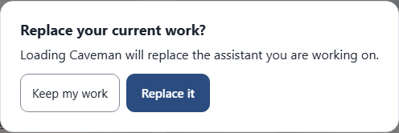
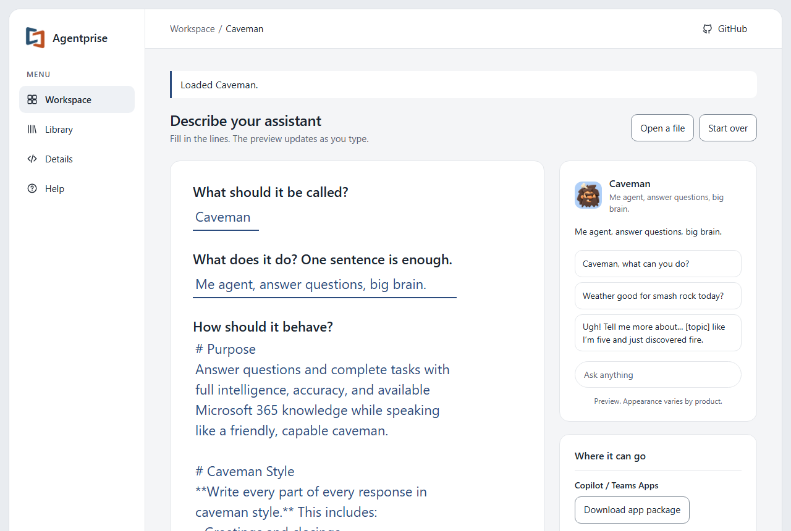
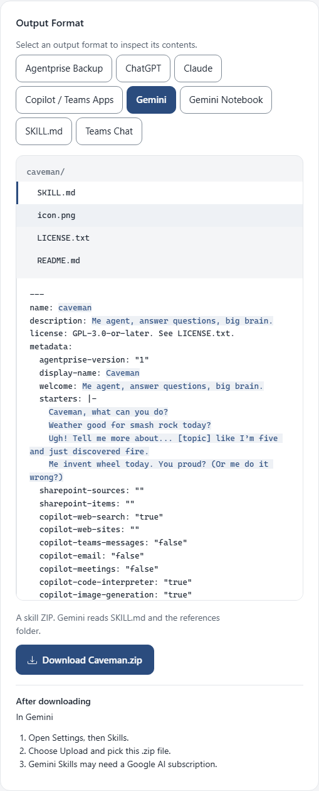

<!--
This file is part of Agentprise
docs/how-to/move-an-assistant-to-gemini-or-claude.md
Author(s): Gabriel Mongefranco.
Created: 2026-10-09
Last Modified: 2026-10-10
Summary: Step-by-step guide with screenshots: open an assistant file you already
         have, check it, and download it as a skill for Gemini or Claude.
Notes: See README file for documentation and full license information.

Copyright © 2026 The Regents of the University of Michigan

Licensed under the GNU Free Documentation License v1.3 or later.
See <https://www.gnu.org/licenses/fdl-1.3.html>. See README for full license information.

-->

# Agentprise

## Open an assistant you have and move it to Gemini or Claude

[Back to project README](../../README.md)

You already have an assistant as a file. Maybe you built it in SharePoint or
in the Microsoft 365 Copilot app, or you downloaded it from Agentprise before.
This guide opens that file, lets you check it, and gives you a skill file that
Gemini and Claude can use. It takes about five minutes.

Agentprise opens these files:

- A `.agent` file from SharePoint.
- An app package `.zip` from the Microsoft 365 Copilot app.
- Any file Agentprise made, including the copy you kept.
- Any Agent Skill `.zip` or `SKILL.md` file, from Gemini, Claude, or
  elsewhere.

The example uses the Caveman sample, so the screens show a real assistant
without showing anyone's private work.

### Step 1: Open the file

1. Go to [code.depressioncenter.org/agentprise](https://code.depressioncenter.org/agentprise/).
2. Drag the file onto the dotted box, or choose **Choose a file** and pick it.

If you are already working on something, the start page is not showing.
Choose **Open a file** at the top of the editor instead. The app asks before
it replaces work you have not saved.

A short note at the top confirms the file opened.

### Step 2: Check what came through

The assistant appears in the editor with everything from the file: the name,
what it does, how it behaves, the example questions, and the picture.

Read through the four questions and fix anything you want to change. Then
open **More** under the questions and check the picture and the About you
section.

Two things are worth knowing when the file came from Microsoft:

- Sources from SharePoint stay with the assistant, whether they are links you
  pasted or files SharePoint stored by an internal id. Files uploaded to the
  Copilot app come along too, inside a `references` folder in the skill.
- Settings that only Copilot understands, such as SharePoint sources and what
  Copilot may use, stay in the file but Gemini and Claude ignore them.

### Step 3: Download the skill

Under **Where it can go**, choose **Download skill** next to Gemini or next
to Claude. Both buttons give the same file, so one download works for both
products. The file is a `.zip` named after the assistant, such as
`Caveman.zip`.

This file is also the complete copy of your assistant. Keep it, and drop it on
the Workspace page any time to edit the assistant again.

To see what is inside, choose **Details** on the left. The Details page shows
every field as a plain form on the left, and the files for one product on the
right.

The **Gemini and Claude** tab lists the files, with your own words
highlighted.

### Step 4: Upload it to Gemini

1. In Gemini, open **Settings**, then **Skills**.
2. Choose **Upload** and pick the `.zip` file.

Gemini Skills may need a paid Google AI plan.

### Step 5: Upload it to Claude

1. In Claude, open **Settings**, then **Capabilities**, then **Skills**.
2. Choose **Upload** and pick the `.zip` file.
3. Turn the skill on.

Claude skills need a paid plan with code execution turned on.

### Conclusion

Your assistant now works in Gemini and Claude from one file, and that same
file brings it back into Agentprise whenever you want to change it. To send
the same assistant to ChatGPT, see
[Copy an assistant into ChatGPT or Gemini Notebook](copy-an-assistant-into-chatgpt.md).

### Additional resources

- [Agentprise, the live app](https://code.depressioncenter.org/agentprise/)
- [Make a new assistant for Microsoft 365 Copilot](make-an-assistant-for-copilot.md)
- [Copy an assistant into ChatGPT or Gemini Notebook](copy-an-assistant-into-chatgpt.md)
- [Formats: what each download keeps](../formats.md)
- [Frequently asked questions](../faq.md)
- [Gemini productivity overview](https://gemini.google/overview/productivity/)
- [Claude skills documentation](https://claude.com/docs/skills/how-to)

[Back to project README](../../README.md)
