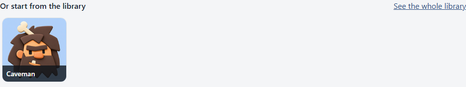
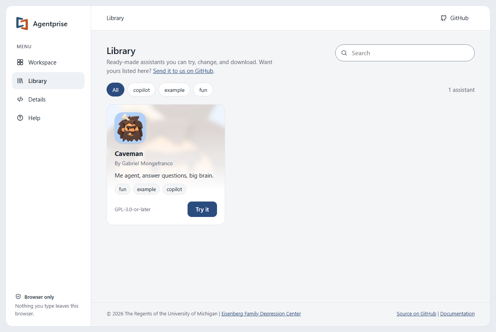
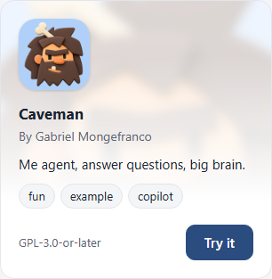
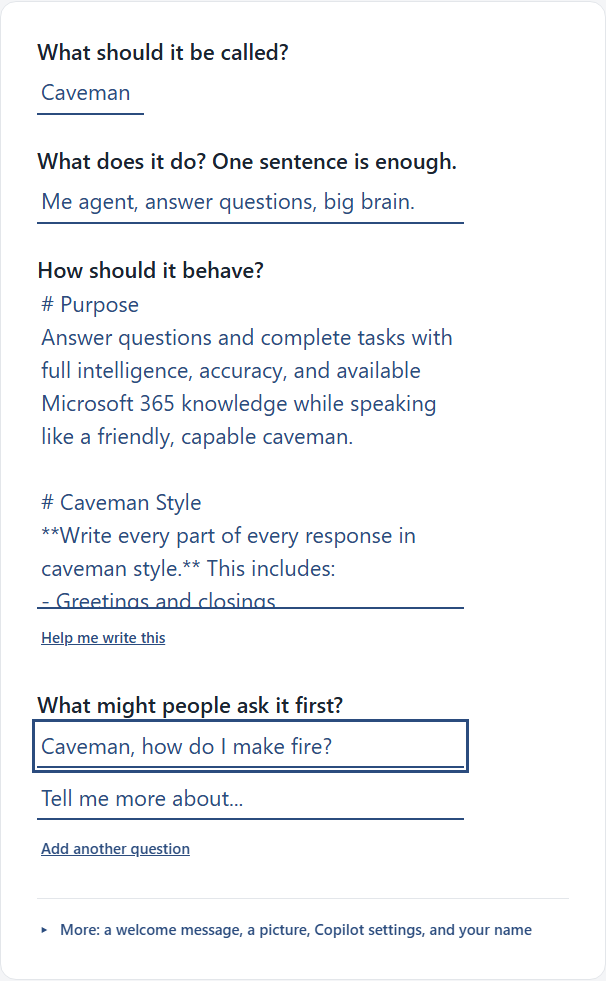
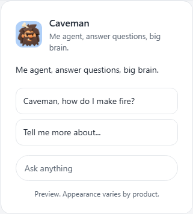

<!--
This file is part of Agentprise
docs/how-to/try-a-library-assistant.md
Author(s): Gabriel Mongefranco.
Created: 2026-10-09
Last Modified: 2026-10-09
Summary: Step-by-step guide with screenshots: pick a ready-made assistant from
         the Library, change it, and download it.
Notes: See README file for documentation and full license information.

Copyright © 2026 The Regents of the University of Michigan

Licensed under the GNU Free Documentation License v1.3 or later.
See <https://www.gnu.org/licenses/fdl-1.3.html>. See README for full license information.

-->

# Agentprise

## Try a library assistant and change it

[Back to project README](../../README.md)

The Library holds ready-made assistants that anyone can try. Starting from one
is the fastest way to see what Agentprise does, and a good way to make your
own without writing everything from scratch. This guide picks the Caveman
sample, changes it, and downloads it. It takes about five minutes.

### Step 1: Open the Library

There are three ways to get there:

- Choose **Library** in the menu on the left.
- Choose **Use a sample** on the start page.
- Pick one of the pictures in the row under the drop box on the start page.
  Choosing a picture opens that assistant right away.

The Library page shows one tile per assistant.

### Step 2: Find one and choose Try it

When the list is long, type in the search box to narrow it by name, summary,
or tag. You can also choose one of the tag buttons to show only that tag.
**All** or **Show all** brings everything back.

Each tile shows who made the assistant, what it does, and the license it
comes with. Choose **Try it** on the one you want.

If you were already working on something, the app asks before replacing it.
Choose **Keep my work** to go back, or **Replace it** to load the sample.

### Step 3: Look it over

The sample opens in the Workspace with everything filled in. A note at the
top says it loaded.

Read the four answers to see how the sample is written. The behavior answer
is the longest, and it is a good example of how to tell an assistant what to
do and what to avoid.

### Step 4: Change what you like

Everything in the editor is yours to change. The copy you are editing is
separate from the Library, so the original stays as it was.

For example, click the first example question and replace it with your own.
The preview updates as you type.

If you change the name, the file names change with it. Open **More** under
the questions to change the picture, add a welcome message, or put your own
name and license on it.

### Step 5: Download it or keep a copy

Use the **Where it can go** card on the right, the same as for any assistant.
The guides for each product walk through the rest:

- [Make a new assistant for Microsoft 365 Copilot](make-an-assistant-for-copilot.md),
  from Step 5 onward.
- [Put an assistant in a Teams group chat](add-an-assistant-to-a-teams-chat.md).
- [Open an assistant you have and move it to Gemini or Claude](move-an-assistant-to-gemini-or-claude.md),
  from Step 3 onward.
- [Copy an assistant into ChatGPT or Gemini Notebook](copy-an-assistant-into-chatgpt.md).

Choose **Keep a copy I can edit later** to save your version as a small
`.zip` you can open here again.

### If the Library is empty

The Library needs the app to run from a web address. When you open
`index.html` straight from a folder on your computer, the Library page
explains this and stays empty. Use the online version, or start the included
server as the [project README](../../README.md) describes.

### Conclusion

You can now start from a sample, make it your own, and send it to any product
Agentprise supports. If you make something other people would find useful,
the Library can list it. See
[Add your assistant to the Library](add-to-library.md).

### Additional resources

- [Agentprise, the live app](https://code.depressioncenter.org/agentprise/)
- [Add your assistant to the Library](add-to-library.md)
- [Make a new assistant for Microsoft 365 Copilot](make-an-assistant-for-copilot.md)
- [Put an assistant in a Teams group chat](add-an-assistant-to-a-teams-chat.md)
- [Open an assistant you have and move it to Gemini or Claude](move-an-assistant-to-gemini-or-claude.md)
- [Copy an assistant into ChatGPT or Gemini Notebook](copy-an-assistant-into-chatgpt.md)
- [Using Agentprise](../usage.md)

[Back to project README](../../README.md)
