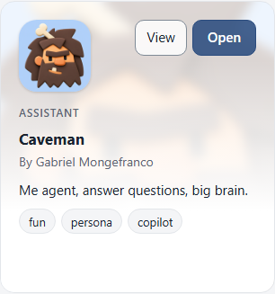
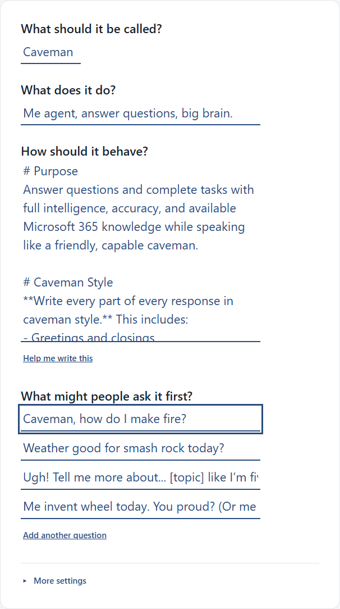

<!--
This file is part of Agentprise
docs/how-to/try-a-library-assistant.md
Author(s): Gabriel Mongefranco.
Created: 2026-10-09
Last Modified: 2026-10-10
Summary: Step-by-step guide with screenshots: pick a ready-made assistant from
         the Library, preview it, add it to your projects, change it, and
         download it.
Notes: See README file for documentation and full license information.

Copyright © 2026 The Regents of the University of Michigan

Licensed under the GNU Free Documentation License v1.3 or later.
See <https://www.gnu.org/licenses/fdl-1.3.html>. See README for full license information.

-->

# Agentprise

## Try a library assistant and change it

[Back to project README](../../README.md)

The Library holds ready-made assistants and skills that anyone can try.
Starting from one is the fastest way to see what Agentprise does, and a good
way to make your own without writing everything from scratch. This guide picks
the Caveman sample, changes it, and downloads it. It takes about five minutes.
Some screenshots on this page show an earlier version of the app, so a few
buttons and labels may look different.

### Step 1: Open the Library

There are three ways to get there:

- Choose **Library** in the menu on the left.
- Choose **Use a sample** on the start page.
- Pick one of the pictures in the row under the drop box on the start page.
  Choosing a picture adds that assistant to your projects and opens it right
  away.

The Library page shows one card for each entry.

### Step 2: Find one and look inside

When the list is long, type in the search box to narrow it by name, summary,
kind, or tag. You can also choose one of the tag buttons to show only that tag.
**All** or **Show all** brings everything back.

Each card shows:

- What kind of entry it is: **Assistant**, **Skill**, or
  **Assistant with skills**.
- Who made it, what it does, and the license it comes with.
- For some entries, a line that says what it needs to work, such as a tool it
  can use.

To look inside before you take it, choose **View** on the card. A window
opens with what the entry holds, a few questions people might ask it, and the
start of its instructions. Choose **Close** to go back, or **Try it** to take
it.

### Step 3: Choose Try it

Choose **Try it** on the card or in the preview. Agentprise adds a copy of the
entry to **Your projects** on the Workspace page and opens it.

If you already tried the same entry before, the app asks what to do:

- **Keep both** adds a second copy, with "(copy)" at the end of its name.
- **Replace mine** puts a fresh copy in place of yours. Any changes you made
  to yours are lost.
- **Cancel** leaves your projects as they were.

The screenshot below shows an earlier version of this question, which had two
buttons instead of three.

### Step 4: Look it over

The sample opens in the project editor with everything filled in. A note at
the top says it loaded.

Read the four answers to see how the sample is written. The behavior answer
is the longest, and it is a good example of how to tell an assistant what to
do and what to avoid.

### Step 5: Change what you like

Everything in the editor is yours to change. Your copy is separate from the
Library, so the original stays as it was. Your changes are saved in the
browser as you type.

For example, click the first example question and replace it with your own.
The preview updates as you type.

If you change the name, the file names change with it. Open **More settings**
under the questions to change the picture, add a welcome message, or put your
own name and license on it under **Publisher details**.

### Step 6: Download it or download a backup

Use the **Download** card on the right, the same as for any assistant.
The guides for each product walk through the rest:

- [Make a new assistant for Microsoft 365 Copilot](make-an-assistant-for-copilot.md),
  from Step 5 onward.
- [Put an assistant in a Teams group chat](add-an-assistant-to-a-teams-chat.md).
- [Open an assistant you have and move it to Gemini or Claude](move-an-assistant-to-gemini-or-claude.md),
  from Step 3 onward.
- [Copy an assistant into ChatGPT or Gemini Notebook](copy-an-assistant-into-chatgpt.md).

Choose **Download Backup** to save your version of the whole project as a
`.zip` you can open here again.

### Add a skill from the Library

Some Library entries are skills: sets of steps an assistant follows only when
a question needs them. To give a skill to an assistant you are working on:

1. Open your project, then go to the Library.
2. Choose **View** on the skill.
3. Choose **Add to** followed by the name of your project.
4. Back in the project, choose your assistant in the **In this project** bar,
   and tick the skill under **Skills it can use**.

### If the Library is empty

The Library needs the app to run from a web address. When you open
`index.html` straight from a folder on your computer, the Library page
explains this and stays empty. Use the online version, or start the included
server as the [project README](../../README.md) describes.

### Conclusion

You can now preview a Library entry, add it to your projects, make it your
own, and send it to any product Agentprise supports. If you make something
other people would find useful, the Library can list it. See
[Add your assistant to the Library](add-to-library.md).

### Additional resources

- [Agentprise, the live app](https://code.depressioncenter.org/agentprise/)
- [Add your assistant to the Library](add-to-library.md)
- [Make a new assistant for Microsoft 365 Copilot](make-an-assistant-for-copilot.md)
- [Put an assistant in a Teams group chat](add-an-assistant-to-a-teams-chat.md)
- [Open an assistant you have and move it to Gemini or Claude](move-an-assistant-to-gemini-or-claude.md)
- [Copy an assistant into ChatGPT or Gemini Notebook](copy-an-assistant-into-chatgpt.md)
- [Using Agentprise](../usage.md)

[Back to project README](../../README.md)
